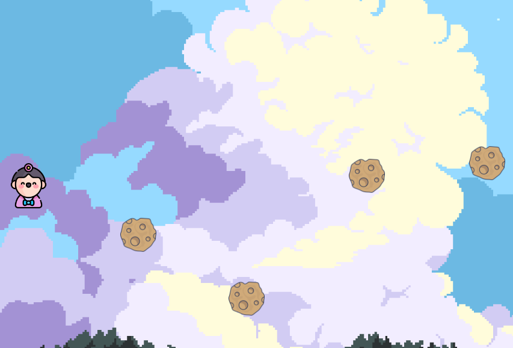

# Ajumma Kimchi Hunter
## Description
Here is the link to try play the game: https://iryna1791.github.io/ajumma-kimchi-hunter/
The player must move up and down (using the arrows) to avoid collision. If the player collide with the rock: Game over and can click on the button: “Start Game Again”.

 
## MVP (DOM)
•	The game has one player
•	The player can move up and down
•	Rocks appear randomly
•	Rocks move towards the player from right to left
•	When colliding with a player, game over

## Data structure
# game.js
Game  {}
checkObstaclesOut() {}
start() {}
startObstacle() {}
Player () {}
createPlayer() {}
move() {}
moveUp() {}
moveDown() {}
Obstacles() {}
createObstacles() {}
move() {}
collision() {}
gameOver() {}

## States y State Transitions
•	gameScreen
•	gameOverScreen

## Task
•	main- build DOM
•	main- addEventListener
•	main- build GameOverScreen
•	tentacle- move
•	game- GameOver

## Links
- [Github repository Link] (https://github.com/Iryna1791/ajumma-kimchi-hunter)
